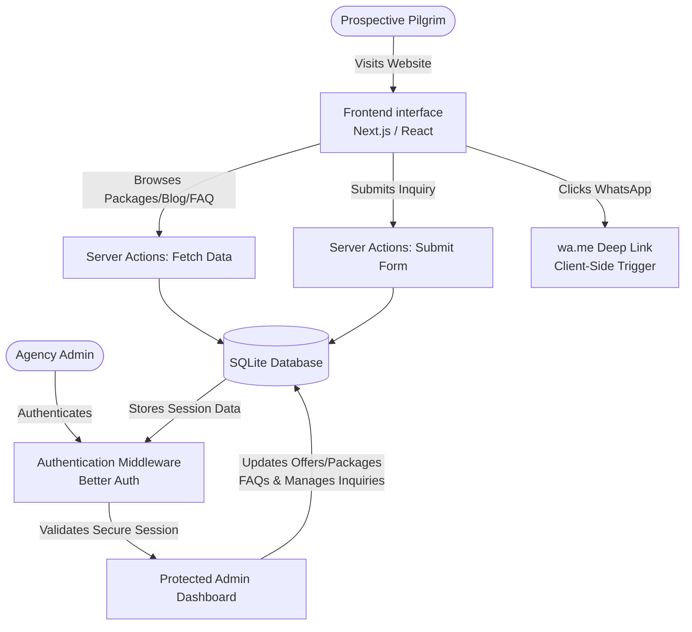
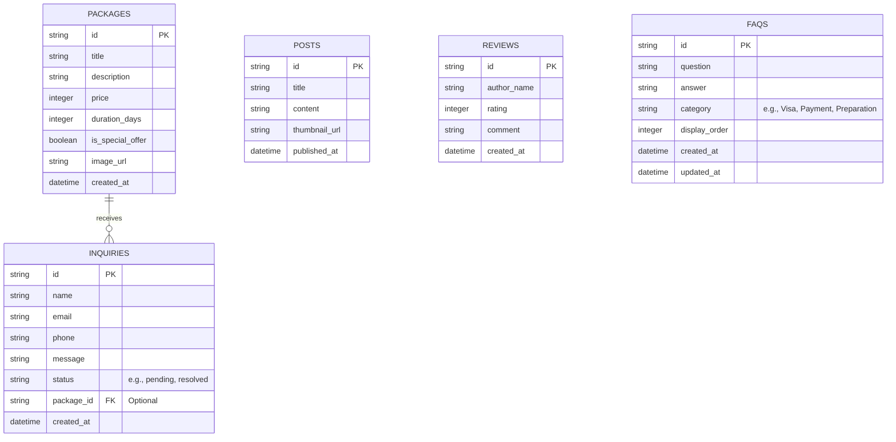

# PRD — Project Requirements Document

## 1. Overview
Finding a reliable and trustworthy travel agency for Umrah and Hajj can be a daunting process for prospective pilgrims. Users often struggle to find clear pricing, verifiable company credibility, and authentic reviews in one place. 

The objective of this project is to build a professional, concise (maximum 5 pages) web application tailored for an Umrah and Hajj travel agency. The platform will serve as a digital storefront designed to establish profound trust with prospective pilgrims, showcase detailed travel packages, highlight special offers to encourage return visits, and capture leads through an easy-to-use contact form and instant messaging channels.

## 2. Requirements
*   **Page Limit:** The website must be strictly contained within 5 core pages: **Home**, **Packages** (including dynamic Trip Details), **Gallery & About**, **News/Blog**, and **Contact**.
*   **Trust-Centric Design:** Prominent display of company credentials, licenses, client reviews, and visual proof of past trips. Emphasize 'Social Proof' elements such as total pilgrims served, years of operation, and partner certifications to establish immediate credibility and reduce decision friction.
*   **Responsive User Interface:** A mobile-first design, ensuring that users browsing on their smartphones have a seamless experience.
*   **Lead Generation:** A frictionless way for users to contact the agency or inquire about specific packages, supporting both form submissions and instant chat.
*   **Content Management:** A secure way for the agency to update special offers, news blogs, trip package details, and FAQ content.
*   **Secure Admin Access:** The CMS and data modification tools must be protected by a robust, session-based authentication system to prevent unauthorized access.

## 3. Core Features
*   **Trip Details & Packages Showcase:** Clear, organized listings of Hajj and Umrah packages, including itineraries, pricing, durations, and what is included/excluded. Dynamic routing will render individual trip details pages.
*   **Trust & Credibility Assets:** A dedicated photo gallery of past trips, verified testimonials, visible certifications, and explicit social proof metrics (e.g., total pilgrims served, success rates, airline/hotel partnerships) to build maximum trust.
*   **Instant WhatsApp Integration:** A persistent, floating action button and contextual 'Chat Now' triggers that allow pilgrims to instantly connect with an agent via WhatsApp for real-time consultation and booking assistance without leaving the page.
*   **Frequently Asked Questions (FAQ):** A searchable, categorized Q&A section addressing common pilgrim inquiries (e.g., visa requirements, payment plans, preparation tips) to reduce bounce rates and pre-qualify leads before contact.
*   **Interactive Contact Form:** A user-friendly form allowing pilgrims to ask questions or request bookings, with inquiries saved directly to the database.
*   **News Blog & Updates:** A space to share valuable tips for pilgrims, company updates, and educational Islamic content.
*   **Dynamic Special Offers:** Highlighted promotional banners or sections (e.g., early bird discounts, family packages) designed to encourage users to return to the site.
*   **Protected Admin Dashboard:** A secure, role-gated interface for agency staff to create, update, or delete packages, blog posts, FAQs, and manage incoming inquiries.

## 4. User Flow
1.  **Discovery:** The user arrives on the **Home** page and is immediately greeted with the agency's credentials, high-quality images, explicit social proof metrics, and a highlighted "Special Offer" banner.
2.  **Exploration:** The user navigates to the **Packages** page to compare different Umrah/Hajj options, viewing transparent prices and detailed itineraries. Clicking a package opens a dynamic **Trip Details** view.
3.  **Trust Building:** The user checks the **Gallery & About** page to view photos of past jamaah (pilgrims), reads positive reviews, and verifies legal licenses.
4.  **Education & FAQ:** The user visits the FAQ or **News/Blog** section to read about preparation tips, visa policies, or recent articles, alleviating common concerns.
5.  **Instant Consultation (Alternative Path):** At any point during their journey, users can click the floating WhatsApp widget to initiate an instant conversation with an agent, enabling real-time consultation and immediate booking without filling out forms.
6.  **Conversion:** Convinced by the agency's credibility and offers, the user navigates to the **Contact** page, fills out the inquiry form, and hits submit. A success message confirms their inquiry was received.

**Admin Flow:**
1.  **Authentication:** The agency admin navigates to the `/admin/login` route, enters verified credentials, and securely logs in via Better Auth.
2.  **Dashboard Access:** Upon successful session validation, the admin accesses the protected dashboard to view new inquiries, update travel packages, publish blog posts, manage FAQs, and toggle special offers.
3.  **Session Termination:** After completing updates, the admin logs out, securely destroying the session and returning to the public site.

## 5. Architecture
The application will follow a modern, server-rendered architecture using a React-based framework. The frontend will communicate seamlessly with backend server actions to fetch package details, submit contact forms, and manage FAQ content directly to a lightweight relational database. The Admin Dashboard will be isolated behind a middleware authentication layer. WhatsApp integration will be handled via client-side deep links to minimize server overhead.

## 6. Database Schema
To support the 5-page application, the database will store information about travel packages, blog posts, contact inquiries, reviews, and frequently asked questions. Session management for authentication will be handled internally by Better Auth using the same database instance.

*   **Packages:** Stores the details of the Hajj/Umrah trips available.
*   **Inquiries:** Captures leads submitted through the contact form. 
*   **Posts:** Stores the news & blog articles.
*   **Reviews:** Stores customer testimonials to build credibility.
*   **FAQS:** Stores categorized questions and answers for the public FAQ section, managed by admins.

## 7. Tech Stack
Based on the goal of building a robust, modern React application efficiently, the following tech stack is recommended:

*   **Frontend & Backend Framework:** **Next.js** (Provides React for the UI, along with built-in routing for the 5 pages and server actions for backend logic).
*   **Styling & UI Components:** **Tailwind CSS** (for rapid styling) combined with **shadcn/ui** (for beautiful, accessible, and ready-to-use form and gallery components).
*   **Database:** **SQLite** (Lightweight, incredibly fast, and perfect for a read-heavy content website that doesn't have massive concurrent write operations).
*   **ORM (Object-Relational Mapping):** **Drizzle ORM** (To safely and easily interact with the SQLite database).
*   **Authentication (Admin Only):** **Better Auth** (To securely manage agency login, session tokens, and route protection for the CMS).
*   **WhatsApp Integration Component:** A lightweight, floating UI module (custom Tailwind or community React component) that triggers `wa.me` deep links with pre-filled context messages, ensuring seamless cross-device mobile/desktop communication without requiring backend polling.

## 8. Authentication Flow
To ensure the integrity of the CMS and prevent unauthorized modifications, the Admin Dashboard will be strictly protected using **Better Auth**. The following authentication flow outlines the secure process for agency administrators.

### 8.1. Secure Admin Login Process
*   **Access Point:** Administrators navigate to a dedicated `/admin/login` route.
*   **Credential Verification:** The system collects email and password. Better Auth handles server-side hashing validation and protects against brute-force attempts via built-in rate limiting and IP throttling.
*   **Validation Flow:** Credentials are verified against the `user` table managed by Better Auth. If valid, a new session record is created in the database, and a secure token is issued.
*   **Success State:** Upon successful validation, the system generates a secure, HTTP-only, SameSite=Strict session cookie and redirects the user to the Admin Dashboard.

### 8.2. Session Management
*   **Cookie-Based Sessions:** All authentication state is maintained via secure cookies. The session cookie contains an encrypted payload that is verified on each request without exposing sensitive data.
*   **Session Duration & Refresh:** Admin sessions will expire after a configurable period of inactivity (default: 7 days). Better Auth automatically refreshes the session expiration window on active usage to maintain a seamless experience.
*   **Concurrent Session Tracking:** The system supports multiple active sessions per admin device. Admins can view active devices from the dashboard and manually revoke suspicious sessions.
*   **Session Invalidation:** Sessions are automatically destroyed across all devices if an admin changes their password or explicitly logs out.

### 8.3. Protected Access & Middleware
*   **Route Guarding:** Next.js Middleware intercepts all requests to `/admin/*` paths. If a valid session cookie is missing, expired, or fails cryptographic verification, the user is immediately redirected to `/admin/login`.
*   **Server Actions Protection:** All backend Server Actions that mutate data (e.g., creating packages, publishing blogs, updating inquiry status, managing FAQs) will execute a `requireAuth()` check before interacting with Drizzle ORM. This ensures direct API bypasses are impossible.
*   **Role-Based Access Control (RBAC):** The current implementation uses a single privileged admin role. The authentication layer is structured to easily support future role expansion (e.g., `editor`, `content_manager`) without architectural changes.

### 8.4. Security Best Practices
*   **HTTPS Enforcement:** All authentication traffic must travel over encrypted connections. Cookies are flagged `Secure` to prevent interception.
*   **CSRF Protection:** Better Auth automatically generates and validates CSRF tokens for all form submissions and Server Actions modifying state.
*   **Password Policy Enforcement:** The initial admin setup enforces strong password requirements (minimum length, complexity) to mitigate credential compromise.
*   **Audit Logging (Future-Ready):** The authentication layer is designed to easily integrate with an audit log table, allowing future tracking of who modified packages or inquiries and when.

### 8.5. Integration Points
*   **Client-Side:** React hooks (`useSession`) provided by Better Auth will conditionally render admin navigation links, protect UI states, and trigger redirects on session expiry.
*   **Server-Side:** Next.js Server Actions will use Better Auth’s `getSession()` to authenticate requests before querying or mutating the SQLite database. Unauthenticated mutation attempts will return a `401 Unauthorized` response.
*   **Logout Mechanism:** Clicking "Logout" triggers a dedicated Server Action that deletes the current session record from the database, clears the session cookie, and redirects the user to the public Home page.